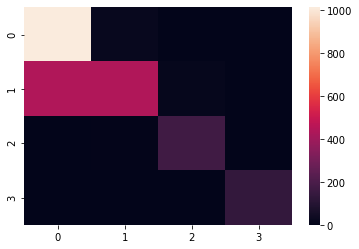
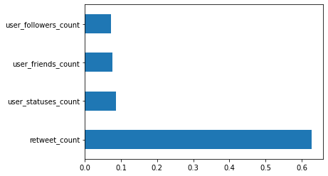

# My Portfolio
This repository contains my personal portofolio for the past few months.
All of these are written in python and used existing dataset.

## [Project 1: Twitter Classifier Using Naive-Bayes Model.](https://github.com/agung67/MyPortfolio/tree/main/Twitter%20Classification)
  This project was created for predicting a tweet popularity with user-based feature which contains information such as user account age, number of retweets, number of likes, etc. The dataset was obtained for 3 weeks with total of 7500 tweets. Given a dataset from Twitter which going to be processed with Naive-Bayes model to predict which tweet will be popular. 
  Best features was selected with Extra Tree Classifier and later processed with Naive Bayes Model. The accuracy of the model is 77% and the over-sampling and under-sampling method didn't give any significant change with the accuracy.
  

## [Project 2: Used Car Classification using Support Vector Machine Model.](https://github.com/agung67/MyPortfolio/tree/main/Used%20car)
This project predicts the type of car commonly used in a state of Virginia. The data was obtained from craigslist with total of over 20.000 car listings. This project will process the raw data first with feature engineering and later will be predicted with Support Vector Machine machine learning model. The accuracy of the model is 97% with the processed data and 55% with unprocessed data.
 
Here's the confusion matrix of the model with processed data

and here's the confusion matrix of the model with unprocessed data

## [Project 3: Simple Covid-19 Data Visualisation.](https://github.com/agung67/MyPortfolio/tree/main/Data%20Covid)
  This project is a simple data visualisation of Covid-19 data obtained from 22nd January 2020 to 26th April 2020. This project uses seaborn and pyproj to create a plotting of confirmed case, recovered case, and confirmed death in each countries and also plot which countries that has a confirmed Covid case.
  
.png)
.png)
.png)
.png)

